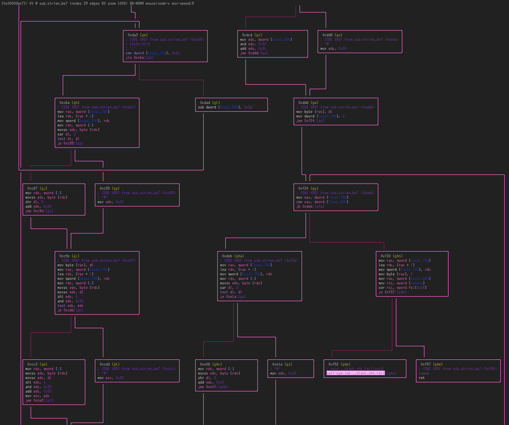

# dec\_dec\_dec

## Overview

This program takes a flag via command-line argument, does some encoding on that flag, compares that result with a fixed string constant, and then outputs `correct :)` or `incorrect :(` based on that.  In order to recover the flag, we needed to find the input that would trigger the "correct" branch.

The main challenge was to figure out what each of the three encoding functions was doing.  For the first two, we were able to identify them based on some test inputs and outputs.  For the last one, we didn't recognize its behavior, so we decided to treat it as a black box.  From cursory inspection, it seemed to be a [one-to-one function](https://en.wikipedia.org/wiki/Injective_function), and therefore reversible.  We enumerated a full mapping of its inputs to outputs, and then inverted that mapping to create a decoding function.

## Initial Characterization

We're given a single binary.  Let's run it and see what happens:

```sh
$ ./dec_dec_dec-c55c231bfbf686ab058bac2a56ce6cc49ae32fe086af499571e335c9f7417e5b
./dec_dec_dec flag_string_is_here
```

Looks like it wants the flag passed as an argument.

```sh
$ ./dec_dec_dec-c55c231bfbf686ab058bac2a56ce6cc49ae32fe086af499571e335c9f7417e5b definitely_the_flag
incorrect :(
```

Let's check out what kind of binary it is (results are abridged):

```sh
$ rabin2 -I dec_dec_dec-c55c231bfbf686ab058bac2a56ce6cc49ae32fe086af499571e335c9f7417e5b

class    ELF64
machine  AMD x86-64 architecture
pic      true
```

OK, looks like a 64-bit x86 binary with position-independent code.

## Analysis of `main`

Firing up r2 with `-A` for analysis, we can look at the main function:

```asm
$ r2 -A dec_dec_dec-c55c231bfbf686ab058bac2a56ce6cc49ae32fe086af499571e335c9f7417e5b
> pdf @ main

/ (fcn) main 233
|   main ();
|           ; var int local_20h @ rbp-0x20
|           ; var int local_14h @ rbp-0x14
|           ; var int local_8h @ rbp-0x8
|              ; DATA XREF from 0x0000074d (entry0)
|           0x0000104a      55             push rbp
|           0x0000104b      4889e5         mov rbp, rsp
|           0x0000104e      4883ec20       sub rsp, 0x20
|           0x00001052      897dec         mov dword [local_14h], edi
|           0x00001055      488975e0       mov qword [local_20h], rsi
|           0x00001059      837dec02       cmp dword [local_14h], 2    ; [0x2:4]=0x102464c
|       ,=< 0x0000105d      7416           je 0x1075
|       |   0x0000105f      488d3d920100.  lea rdi, str.._dec_dec_dec_flag_string_is_here ; 0x11f8 ; "./dec_dec_dec flag_string_is_here "
|       |   0x00001066      e88df6ffff     call sym.imp.puts           ; int puts(const char *s)
|       |   0x0000106b      bf00000000     mov edi, 0
|       |   0x00001070      e8abf6ffff     call sym.imp.exit           ; void exit(int status)
|       |      ; JMP XREF from 0x0000105d (main)
|       `-> 0x00001075      488b45e0       mov rax, qword [local_20h]
|           0x00001079      4883c008       add rax, 8
|           0x0000107d      488b00         mov rax, qword [rax]
|           0x00001080      4889c7         mov rdi, rax
|           0x00001083      e878f6ffff     call sym.imp.strlen         ; size_t strlen(const char *s)
|           0x00001088      4883c001       add rax, 1
|           0x0000108c      4889c7         mov rdi, rax
|           0x0000108f      e884f6ffff     call sym.imp.malloc         ;  void *malloc(size_t size)
|           0x00001094      488945f8       mov qword [local_8h], rax
|           0x00001098      488b45e0       mov rax, qword [local_20h]
|           0x0000109c      4883c008       add rax, 8
|           0x000010a0      488b00         mov rax, qword [rax]
|           0x000010a3      4889c7         mov rdi, rax
|           0x000010a6      e855f6ffff     call sym.imp.strlen         ; size_t strlen(const char *s)
|           0x000010ab      4889c2         mov rdx, rax
|           0x000010ae      488b45e0       mov rax, qword [local_20h]
|           0x000010b2      4883c008       add rax, 8
|           0x000010b6      488b08         mov rcx, qword [rax]
|           0x000010b9      488b45f8       mov rax, qword [local_8h]
|           0x000010bd      4889ce         mov rsi, rcx
|           0x000010c0      4889c7         mov rdi, rax
|           0x000010c3      e828f6ffff     call sym.imp.strncpy        ; char *strncpy(char *dest, const char *src, size_t  n)
|           0x000010c8      488b45f8       mov rax, qword [local_8h]
|           0x000010cc      4889c7         mov rdi, rax
|           0x000010cf      e88cf7ffff     call sub.strlen_860         ; size_t strlen(const char *s)
|           0x000010d4      488945f8       mov qword [local_8h], rax
|           0x000010d8      488b45f8       mov rax, qword [local_8h]
|           0x000010dc      4889c7         mov rdi, rax
|           0x000010df      e875feffff     call sub.strlen_f59         ; size_t strlen(const char *s)
|           0x000010e4      488945f8       mov qword [local_8h], rax
|           0x000010e8      488b45f8       mov rax, qword [local_8h]
|           0x000010ec      4889c7         mov rdi, rax
|           0x000010ef      e8f3faffff     call sub.strlen_be7         ; size_t strlen(const char *s)
|           0x000010f4      488945f8       mov qword [local_8h], rax
|           0x000010f8      488b15110f20.  mov rdx, qword str.25_Q44E233___E_M34____LS5VEQ45_M2S___7___3T ; [0x202010:8]=0x11c8 str.25_Q44E233___E_M34____LS5VEQ45_M2S___7___3T
|           0x000010ff      488b45f8       mov rax, qword [local_8h]
|           0x00001103      4889d6         mov rsi, rdx
|           0x00001106      4889c7         mov rdi, rax
|           0x00001109      e802f6ffff     call sym.imp.strcmp         ; int strcmp(const char *s1, const char *s2)
|           0x0000110e      85c0           test eax, eax
|       ,=< 0x00001110      750e           jne 0x1120
|       |   0x00001112      488d3d020100.  lea rdi, str.correct__:     ; 0x121b ; "correct  :)"
|       |   0x00001119      e8daf5ffff     call sym.imp.puts           ; int puts(const char *s)
|      ,==< 0x0000111e      eb0c           jmp 0x112c
|      ||      ; JMP XREF from 0x00001110 (main)
|      |`-> 0x00001120      488d3d000100.  lea rdi, str.incorrect_:    ; 0x1227 ; "incorrect :("
|      |    0x00001127      e8ccf5ffff     call sym.imp.puts           ; int puts(const char *s)
|      |       ; JMP XREF from 0x0000111e (main)
|      `--> 0x0000112c      b800000000     mov eax, 0
|           0x00001131      c9             leave
\           0x00001132      c3             ret
```

It looks like it:
* checks that it has been given two arguments (one will be the name of the binary, the other should be our flag guess) and exits otherwise
* `malloc`s a size equal to the argument string length + 1
* `strncpy`s the argument into the `malloc`d buffer
* calls three mysterious functions, passing `local_8h` to each of them and then storing the result back into `local_8h`. Those functions are: `strlen_860`, `strlen_f59`, and `strlen_be7`
* compares the output of the last mysterious function call to the `str.25_Q44E233___E_M34____LS5VEQ45_M2S___7___3T` string
* prints `correct  :)` if they match and `incorrect :(` if they do not

That would seem to suggest that the correct flag is the one which transforms, after being passed through `strlen_860`, `strlen_f59`, and `strlen_be7`, into the `str.25_Q44E233___E_M34____LS5VEQ45_M2S___7___3T` string.

Looking at the disassembly of each of the mystery functions, it's unclear what exactly they do. The first two might be manageable to dissect and reverse, but the last one looks particularly challenging:



Yikes! That's a lot to try to reverse. Let's see what we can do to avoid that kind of manual approach...

## Characterizing the encoding functions

For `sub.strlen_860` and `sub.strlen_f59`, we tried some test inputs in radare2.
We turn off ASLR for reproducability, and pass in something for arg1 to ensure that the program allocates a reasonably-sized buffer. (TODO)

```asm
$ r2 -A -d -Raslr=no -Rarg1=AAAAAAA dec_dec_dec-c55c231bfbf686ab058bac2a56ce6cc49ae32fe086af499571e335c9f7417e5b
Process with PID 23017 started...
= attach 23017 23017
bin.baddr 0x555555554000
Using 0x555555554000
asm.bits 64
= attach 23017 23017
23017
 -- [Some banal r2 quip]

[0x7ffff7dd5ea0]> dcu 0x5555555550d4
Continue until 0x5555555550d4 using 1 bpsize
hit breakpoint at: 5555555550d4
           0x5555555550c3      e828f6ffff     call sym.imp.strncpy    ;[4]   ; char *strncpy(char *dest, const char *src, size_t  n)                                                                               
|           0x5555555550c8      488b45f8       mov rax, qword [local_8h]                                                                                                                                            
|           0x5555555550cc      4889c7         mov rdi, rax                                                                                                                                                         
|           0x5555555550cf      e88cf7ffff     call sub.strlen_860     ;[5]                                                                                                                                         
|           0x5555555550d4      488945f8       mov qword [local_8h], rax                                                                                                                                            
|           0x5555555550d8      488b45f8       mov rax, qword [local_8h]                                                                                                                                            
|           0x5555555550dc      4889c7         mov rdi, rax                                                                                                                                                         
|           0x5555555550df      e875feffff     call sub.strlen_f59     ;[6]                                                                                                                                         
|           0x5555555550e4      488945f8       mov qword [local_8h], rax                                                                                                                                            
|           0x5555555550e8      488b45f8       mov rax, qword [local_8h]                                                                                                                                            
|           0x5555555550ec      4889c7         mov rdi, rax                                                                                                                                                         
|           0x5555555550ef      e8f3faffff     call sub.strlen_be7     ;[7]                                                                                                                                         
|           0x5555555550f4      488945f8       mov qword [local_8h], rax                                                                                                                                            
|           0x5555555550f8      488b15110f20.  mov rdx, qword [0x555555756010]       ; [0x555555756010:8]=0x5555555551c8 str.25_Q44E233___E_M34____LS5VEQ45_M2S___7___3T                                            
|           0x5555555550ff      488b45f8       mov rax, qword [local_8h]                                                                                                                                            
|           0x555555555103      4889d6         mov rsi, rdx                                                                                                                                                         
|           0x555555555106      4889c7         mov rdi, rax                                                                                                                                                         
|           0x555555555109      e802f6ffff     call sym.imp.strcmp     ;[8]   ; int strcmp(const char *s1, const char *s2)                                                                                          
|           0x55555555510e      85c0           test eax, eax                                                                                                                                                        
|       ,=< 0x555555555110      750e           jne 0x555555555120      ;[9]                                                                                                                                         
|       |   0x555555555112      488d3d020100.  lea rdi, str.correct__:       ; 0x55555555521b ; "correct  :)"                                                                                                       
|       |   0x555555555119      e8daf5ffff     call sym.imp.puts       ;[?]    ; int puts(const char *s)                                                                                                            
|      ,==< 0x55555555511e      eb0c           jmp 0x55555555512c      ;[?]                                                                                                                                         
|      |`-> 0x555555555120      488d3d000100.  lea rdi, str.incorrect_:       ; 0x555555555227 ; "incorrect :("                                                                                                     
|      |    0x555555555127      e8ccf5ffff     call sym.imp.puts       ;[?]    ; int puts(const char *s)                                                                                                            
|      `--> 0x55555555512c      b800000000     mov eax, 0                                                                                                                                                           
|           0x555555555131      c9             leave                                                                                                                                                                
\           0x555555555132      c3             ret                                                                                                                                                                  

```

If you squint, you can see that the addresses are different than the previous main.
That's because we're actually running this program, so the physical address space from the binary has been translated/loaded into a virtual address space.
You can see this translation/offset by running `iM`:

```asm
:> iM
[Main]
vaddr=0x55555555504a paddr=0x0000104a
```

Now we can continue until after each of the encoding functions to see how our input has been changed:

```asm
:> px 48 @ rax
- offset -       0 1  2 3  4 5  6 7  8 9  A B  C D  E F  0123456789ABCDEF
0x555555757280  5155 4642 5155 4642 5151 3d3d 0000 0000  QUFBQUFBQQ==....
0x555555757290  0000 0000 0000 0000 710d 0200 0000 0000  ........q.......
0x5555557572a0  0000 0000 0000 0000 0000 0000 0000 0000  ................
```

`rax` will hold the return value of the function. So the output of the first encoding function is `QUFBQUFBQQ==`
That string looks familiar! Kinda like base64...


```python
$ python
>>> from base64 import b64encode
>>> b64encode("AAAAAAA")
'QUFBQUFBQQ=='
```

Yay! So that confirms our suspicion that the first encoder is base64. 

Note that you can also see the creation of a table of base64 characters in `sub.strlen_860`, which is another hint:

```asm
0x00000881      48b841424344.  movabs rax, 0x4847464544434241       ; 'ABCDEFGH'
0x0000088b      488945b0       mov qword [local_50h], rax
0x0000088f      48b8494a4b4c.  movabs rax, 0x504f4e4d4c4b4a49       ; 'IJKLMNOP'
0x00000899      488945b8       mov qword [local_48h], rax
0x0000089d      48b851525354.  movabs rax, 0x5857565554535251       ; 'QRSTUVWX'
0x000008a7      488945c0       mov qword [local_40h], rax
0x000008ab      48b8595a6162.  movabs rax, 0x6665646362615a59       ; 'YZabcdef'
0x000008b5      488945c8       mov qword [local_38h], rax
0x000008b9      48b86768696a.  movabs rax, 0x6e6d6c6b6a696867       ; 'ghijklmn'
0x000008c3      488945d0       mov qword [local_30h], rax
0x000008c7      48b86f707172.  movabs rax, 0x767574737271706f       ; 'opqrstuv'
0x000008d1      488945d8       mov qword [local_28h], rax
0x000008d5      48b87778797a.  movabs rax, 0x333231307a797877       ; 'wxyz0123'
0x000008df      488945e0       mov qword [local_20h], rax
0x000008e3      48b834353637.  movabs rax, 0x2f2b393837363534       ; '456789+/'
0x000008ed      488945e8       mov qword [local_18h], rax
```

On to the next one:

```asm
:> dcu 0x5555555550e4
Continue until 0x5555555550e4 using 1 bpsize
hit breakpoint at: 5555555550e4

:> px 48 @ rax
- offset -       0 1  2 3  4 5  6 7  8 9  A B  C D  E F  0123456789ABCDEF
0x555555757280  5155 4642 5155 4642 5151 3d3d 0000 0000  QUFBQUFBQQ==....
0x555555757290  0000 0000 0000 0000 2100 0000 0000 0000  ........!.......
0x5555557572a0  4448 534f 4448 534f 4444 3d3d 0000 0000  DHSODHSODD==....
```

It's extra convenient that the previous output is left in memory (`malloc` is called but `free` never is), so we can see the outputs of the two functions inline with each other.

Again, this encoding looks familiar. It maps equal length strings, doesn't affect the `=`s, and predictably maps single characters to single characters...

```python
$ python
>>> ord('Q') - ord('D')
13
>>> ord('U') - ord('H')
13
>>> from codecs import encode
>>> encode("QUFBQUFBQQ==", "rot13")
'DHSODHSODD=='
```

So the second encoding is rot-13! Let's continue to the final one!

```asm
:> dcu 0x5555555550f4
Continue until 0x5555555550f4 using 1 bpsize
hit breakpoint at: 5555555550f4

:> px 96 @ rax
- offset -       0 1  2 3  4 5  6 7  8 9  A B  C D  E F  0123456789ABCDEF
0x555555757280  5155 4642 5155 4642 5151 3d3d 0000 0000  QUFBQUFBQQ==....
0x555555757290  0000 0000 0000 0000 2100 0000 0000 0000  ........!.......
0x5555557572a0  4448 534f 4448 534f 4444 3d3d 0000 0000  DHSODHSODD==....
0x5555557572b0  0000 0000 0000 0000 2100 0000 0000 0000  ........!.......
0x5555557572c0  2c31 2441 3333 5431 2834 545d 2431 2354  ,1$A33T1(4T]$1#T
0x5555557572d0  5d00 0000 0000 0000 310d 0200 0000 0000  ].......1.......
```

This encoding is clearly trickier. It looks like it's mapping 12 bytes to 17 bytes? 🤷‍♀️
There's clearly some pattern/repetition, but figuring it out isn't going to be as easy as the previous two.

## Mapping the mystery encoding function

Since we didn't recognize the behavior of the third encoding function, `sub.strlen_be7`, let's investigate it in a little more depth.

Currently, the only control we have over the input to the function is indirect (i.e. it receives `rot13(base64(argv[1]))`).  In order to characterize the function better, let's try giving it direct input by modifying its input buffer before it receives it.  To do this, let's run the program and break right before the call to `sub.strlen_be7` in `main`:

```asm
0x5555555550ec      4889c7         mov rdi, rax                                                                                                                                                         
0x5555555550ef      e8f3faffff     call sub.strlen_be7     ;[7] 
```

```asm
> dcu 0x5555555550ef
Continue until 0x5555555550ef using 1 bpsize
hit breakpoint at: 5555555550ef
```

If we inspect its first argument (passed in `rdi`), we see the rot13'd base64 string.

```asm
> ps @ rdi
DHSODHSODD==
```

Let's write our own bytes there instead! 

```asm
> w AAAAAAAAA @ rdi
> ps @ rdi
AAAAAAAAAD==
```

Now we step over the call and check the function's output (passed in `rax`):

```asm
> dso
hit breakpoint at: 5555555550f4

> ps @ rax
,04%!04%!04%!1#T]
```

Note that the repetition in the input string (`AAAAAAAAAD==`) is producing repetition in the output string.  

Playing around like this for a while, we notice that— other than some junk at the beginning and end— there appears to be a consistent mapping of every 3 input bytes to 4 output bytes:


```asm
...
> w BBBBBBBBBBB @ rdi
...
> ps @ rax
,0D)"0D)"0D)"0D(]
```

```asm
...
> w AAAAAABBBBBB @ rdi
...
> ps @ rax
,04%!04%!0D)"0D)"
```
Maybe if we enumerate all of these 3-byte to 4-byte mappings, we can just invert the function?

To create a full mapping of the function, our initial approach was to basically script the above r2 commands and call them from Python (see [r2\_mapping\_generator.py](r2_mapping_generator.py)).  However, note that there are `64^3 = 2^18` possible 3-byte base64 inputs, so the inefficiency of this method really adds up.  Even with parallelization, it still took approximately an hour on a fairly powerful machine. 🐢

We later used a different method that was much faster: [dec\_wrapper.c](dec_wrapper.c) loads the `dec_dec_dec` binary as a shared library, and passes every line of input from `stdin` through the encoding function before printing it back out on `stdout`.  The Python script [mapping\_generator.py](mapping_generator.py) uses this instrumentation wrapper to enumerate the function mapping.  Note that since there are no symbols in the binary, we needed to hard-code the offset to the `sub.strlen_be7` that we got from r2, and then cast the pointer to the proper type of function pointer. (Note: [https://cdecl.org/](https://cdecl.org/) is super helpful for the weird C syntax!)  This version ran in under half a second on a single core, which is much more reasonable :) ⚡️

## Decoding the flag

Going back to the `strcmp` call in `main` at `0x1109`:

```asm
0x000010f8      488b15110f20.  mov rdx, qword str.25_Q44E233___E_M34____LS5VEQ45_M2S___7___3T ; [0x202010:8]=0x11c8 str.25_Q44E233___E_M34____LS5VEQ45_M2S___7___3T
0x000010ff      488b45f8       mov rax, qword [local_8h]
0x00001103      4889d6         mov rsi, rdx
0x00001106      4889c7         mov rdi, rax
0x00001109      e802f6ffff     call sym.imp.strcmp         ; int strcmp(const char *s1, const char *s2)
```

Let's look closer at the string constant that our triple-encoded input is being compared with:

```asm
> px 48 @ str.25_Q44E233___E_M34____LS5VEQ45_M2S___7___3T
- offset -   0 1  2 3  4 5  6 7  8 9  A B  C D  E F  0123456789ABCDEF
0x000011c8  4032 352d 5134 3445 3233 333d 2c3e 452d  @25-Q44E233=,>E-
0x000011d8  4d33 343d 2c2c 244c 5335 5645 5134 3529  M34=,,$LS5VEQ45)
0x000011e8  4d32 532d 292c 372d 242f 3354 2000 0000  M2S-),7-$/3T ...

> ps @ str.25_Q44E233___E_M34____LS5VEQ45_M2S___7___3T
@25-Q44E233=,>E-M34=,,$LS5VEQ45)M2S-),7-$/3T
```

Having grabbed this string, in [decode.py](decode.py) we successively invert the three encodings.  Note that for the first stage of decoding, we skip the initial `@` in the string, due to our earlier observation that the first character is irrelevant (it turns out it's `len(decoded_str)+0x20`).  

This gives us, at last, the flag: `TWCTF{base64_rot13_uu}` 🎉🎉🎉

(Oh, it was [uuencoding](https://en.wikipedia.org/wiki/Uuencoding)... 💡)
